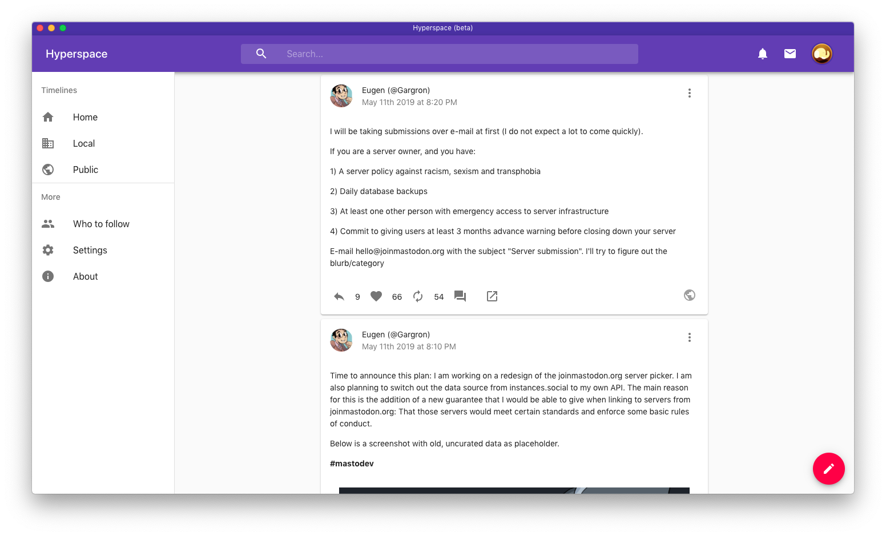

# Hyperspace v1.0

The new beautiful, fluffy client for the fediverse written in TypeScript and React



[](https://matrix.to/#/#hypermasto:matrix.org)
[](https://discord.gg/c69AXwk)
[](https://dev.azure.com/hyperspacedev/Hyperspace/_build/latest?definitionId=1&branchName=master)

Hyperspace is the fluffiest client for Mastodon and other fediverse networks written in TypeScript and React. Hyperspace offers a fun, clean, fast, and responsive design that scales beautifully across devices and enhances the fediverse experience.

> Note: For more information on how Hyperspace 1.0 is different from the *Hyperspace Classic (0.x)* series, please see [MIGRATING.md](MIGRATING.md).

## Build instrictions

### Prerequisites

To develop Hyperspace, you'll need the following tools and packages:

- Node.js 8 or later
- (Optional) Visual Studio Code

### Installing dependencies

First, clone the repository from GitHub:

```bash
git clone https://github.com/hyperspacedev/hyperspace
```

Then, in the app directory, run the following command to install all of the package dependencies:

```npm
npm install
```

### Testing changes

Before testing Hyperspace, make the following change in `config.json`, located in the `public` directory:

```json
    "location": "https://localhost:3000"
```

This is necessary to test Hyperspace locally and will need to be reverted after testing or before releasing to `master`.

> Note: if you are testing the **desktop** version of Hyperspace, replace `https://localhost:3000` with `desktop`.

To run a development version of Hyperspace, either run the `start` task from VS Code or run the following in the terminal:

```npm
npm start
```

The site will be hosted at `https://localhost:3000`, where you can sign in and test Hyperspace using your Mastodon account. If you have signed in before, you will be automatically logged in.

Alternatively, if you are testing the desktop version of Hyperspace, run `npm run electrify` (or `npm run electrify-nobuild`, if you don't want to make another production build). Hyperspace will open in a window where you can sign in and test Hyperspace with your Mastodon account. You'll be logged in automatically if you've signed in before.

### Building a release

To build a release, run the following command:

```npm
npm build
```

The built files will be available under `build` as static files. These files should get hosted to a web server.

#### Building desktop releases

You can run any of the following commands to build a release for the desktop:

- `build-desktop`: Builds the desktop apps for all platforms (eg. Windows, macOS, Linux). Will run `npm run build` before building.
- `build-desktop-win`: Builds the desktop app for Windows without running `npm run build`.
- `build-desktop-darwin`: Builds the desktop apps for macOS (eg. disk image, Mac App Store) without running `npm run build`.
- `build-desktop-linux`: Builds the desktop apps for Linux (eg. Debian package, AppImage, and Snap) without running `npm run build`.
- `build-desktop-linux-select`: Builds the desktop app for Linux without running `npm run build`. _Target is required as a parameter._

> Note: If you are building the macOS version of Hyperspace, add your provisioning profiles and entitlements files in the `desktop` folder and ensure you have installed your developer certificates on your machine before running `build-desktop` or `build-desktop-darwin`.
>
> While the command will run without needing the signature, it is recommended that you make a signed copy to protect users.

> ⚠️ **Notarization**: If you are building the macOS version of Hyperspace, you will also need to set up notarization processes. Hyperspace will _not_ run on devices running macOS Catalina or later without this notarization; please ensure you have the correct certificates and updated notarization scripts in `desktop/notarize.js`.
> 
> When building, the script will aotumatically notarize the app for you after signing it.

The built files will be available under `dist` that can be uploaded to your app distributor or website.

## Contribute

Contrubition guidelines are available in the [contributing file](.github/contributing.md) and when you make an issue/pull request. Additionally, you can access our [Code of Conduct](.github/code_of_conduct.md).

If you want to aid the project in other ways, consider supporting the project on [Patreon](https://patreon.com/marquiskurt). You can also [view all of our contributors](patreon.md) that help make Hyperspace possible.

If you have Matrix, you can join the Hyperspace community ([+hyperspace-masto:matrix.org](https://matrix.to/#/+hyperspace-masto:matrix.org)).
